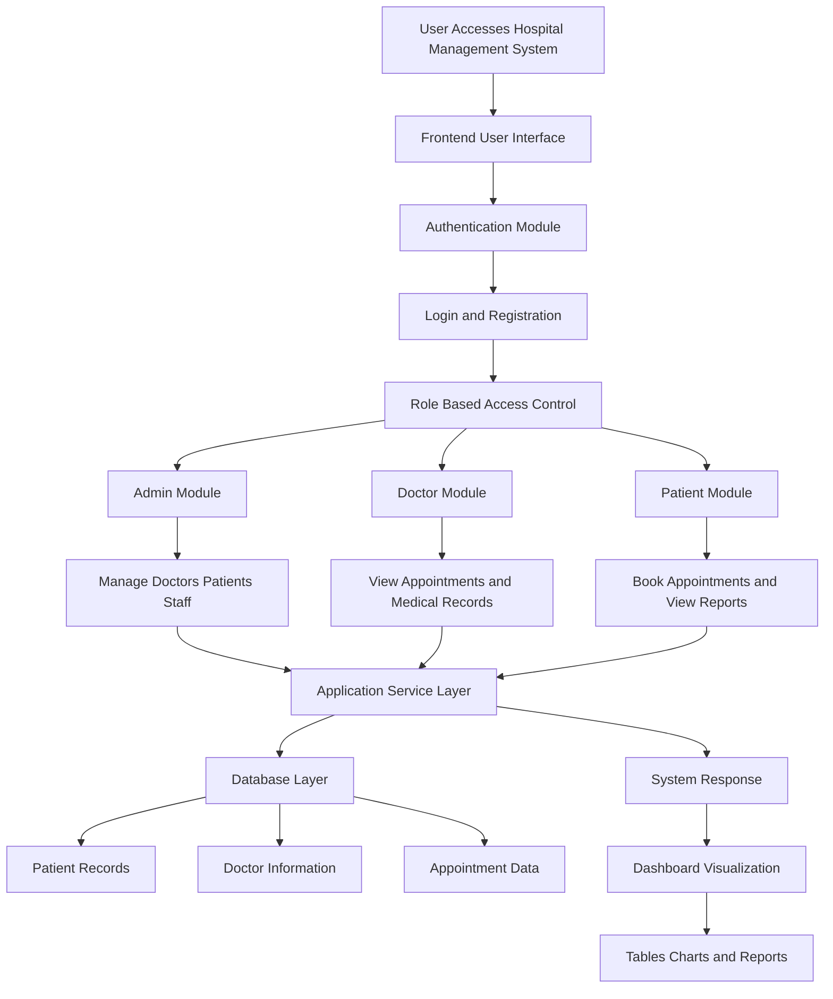

<h1 align="center">🏥 Hospital Management System (HMS)</h1>

<p align="center">
  
  
  
  
  
</p>

<p align="center">
  <b>A Modern, Scalable & AI-Integrated Hospital Management System</b><br/>
  Streamlining hospital operations with smart modules for patients, doctors, billing, appointments, and AI prescriptions.
</p>

---

# 🚀 Project Overview

The **Hospital Management System (HMS)** is a full-featured web application designed to digitize and automate hospital workflows including:

* 👨‍⚕️ Doctor Management
* 🧑‍🤝‍🧑 Patient Records
* 📅 Appointment Scheduling
* 💊 AI Prescription System
* 🧾 Billing & Invoices
* 🛏️ Ward Management
* 📊 Dashboard Analytics
* ⚙️ Admin Settings

This system provides a **centralized dashboard** for efficient hospital administration and real-time data management.

---

# 🎯 Key Features

## 🏥 Core Modules

* 📊 **Dashboard** — Hospital analytics & overview
* 👨‍⚕️ **Doctors Management** — Add, edit, and manage doctors
* 🧑‍🦽 **Patients Management** — Patient registration & tracking
* 📅 **Appointments System** — Smart scheduling system
* 💊 **AI Prescription** — Intelligent prescription interface
* 🧾 **Billing System** — Invoice & payment management
* 🛏️ **Ward Management** — Bed & ward allocation tracking
* 🧭 **Hospital Guide** — Navigation & information system
* ⚙️ **Settings Panel** — System configuration
* 🔐 **Authentication System** — Secure login access

---

# 🏗️ Project Architecture System



---

## 🧩 Layered Architecture Explanation

### 1️⃣ Presentation Layer (UI)

* Built using React + TypeScript
* Handles UI rendering and user interaction
* Fully responsive using Tailwind CSS
* Clean and modern hospital dashboard design

### 2️⃣ Module-Based Page Architecture

| Module          | Description                   |
| --------------- | ----------------------------- |
| Dashboard       | Analytics and system overview |
| Doctors         | Doctor profile management     |
| Patients        | Patient records and history   |
| Appointments    | Scheduling and booking        |
| Billing         | Invoice and payment handling  |
| AI Prescription | Smart medical prescription UI |
| Ward Management | Bed and ward tracking         |
| Settings        | System configuration          |

---

## 🔀 Routing Architecture

```
/login            → Authentication Page
/dashboard        → Main Dashboard
/doctors          → Doctor Management
/patients         → Patient Records
/appointments     → Appointment System
/billing          → Billing Module
/ai-prescription  → AI Prescription Page
/ward-management  → Ward Allocation
/settings         → System Settings
```

---

# 📂 Project Structure

```
src/
│
├── pages/
│   ├── AIPrescription.tsx
│   ├── Appointments.tsx
│   ├── Billing.tsx
│   ├── Dashboard.tsx
│   ├── Doctors.tsx
│   ├── HospitalGuide.tsx
│   ├── Login.tsx
│   ├── Patients.tsx
│   ├── Settings.tsx
│   └── WardManagement.tsx
│
├── components/
├── assets/
├── hooks/
├── utils/
├── services/
└── main.tsx
```

---

# 🛠️ Tech Stack

| Technology                | Role                         |
| ------------------------- | ---------------------------- |
| ⚛️ React + TypeScript     | Frontend Development         |
| ⚡ Vite                    | Fast Build Tool & Dev Server |
| 🎨 Tailwind CSS           | Modern UI Styling            |
| 🟢 Node.js                | Runtime Environment          |
| 🧩 Component Architecture | Scalable UI Design           |

---

# 📦 Installation & Setup

## 🔧 Prerequisites

* Node.js (v16 or higher)
* npm or yarn

## 📥 Step 1: Clone the Repository

```bash
git clone https://github.com/LoganthP/Hospital-Management-System.git
```

## 📁 Step 2: Navigate to Project Folder

```bash
cd Hospital-Management-System
```

## 📦 Step 3: Install Dependencies

```bash
npm install
```

## ▶️ Step 4: Run Development Server

```bash
npm run dev
```

Open in browser:
`http://localhost:5173`

---

# 🔐 Authentication System

* Secure Login Page
* Role-based system ready (Admin / Staff)
* Protected dashboard routes (extendable)
* Secure form validation support

---

# 📊 Dashboard Functionalities

* 📈 Patient statistics
* 👨‍⚕️ Doctor overview
* 📅 Appointment tracking
* 🏥 Hospital performance insights
* 📊 Real-time analytics (scalable)

---

# 💊 AI Prescription Module

* Assist doctors in generating prescriptions
* Improve diagnosis workflow
* Reduce manual medical errors
* Enhance digital healthcare experience
* Future AI API integration ready

---

# 🎨 UI & Design Highlights

* 🧼 Clean & professional hospital UI
* 📱 Fully responsive (Mobile + Desktop)
* 🧩 Modular component architecture
* ⚡ Fast performance with Vite
* 🎯 User-friendly navigation system

---

# 🚀 Future Improvements (Planned)

* 🔔 Notification System
* 🧬 AI Diagnosis Integration
* 🗃️ Database Integration (MongoDB / MySQL / PostgreSQL)
* 📱 Advanced Mobile Optimization
* 🧾 Advanced Billing Reports & Analytics
* 👨‍⚕️ Multi-role Admin Panel
* ☁️ Cloud Deployment Support

---

# 🔮 Recommended Backend Architecture (Future)

```text
        Frontend (React + Vite)
                 │
                 ▼
        Backend (Node.js / Express API)
                 │
        ┌────────┼──────────────┬──────────────┬──────────────┐
        │        │              │              │              │
        ▼        ▼              ▼              ▼              ▼
Authentication  Patient       Doctor        Billing    AI Prescription
   Service      Service       Service       Service        Service
                 │
                 ▼
        Database (MongoDB / MySQL / PostgreSQL)
```
